# Bahr — The Dive

**A homepage redesign for [Bahr](https://bybahr.com), an independent digital agency in Jeddah.**
Built for the GDG on Campus UJ × Bahr "best homepage redesign" challenge.

Bahr's brand is made of depth: *A deeper creative approach*, *Beyond the surface*, *Let's dive deeper*.
The current bybahr.com shows that depth as a static map, with topographic contour lines and a depth gauge.
**The Dive turns it into a journey you take by scrolling.** You start on a bright water surface, break through
it, and sink section by section: **0 m → −40 m → −200 m → −600 m → −1,200 m → −3,000 m**. The light fades, the water
darkens to near black, a live depth meter counts down, and the contact call to action is waiting on the seabed.

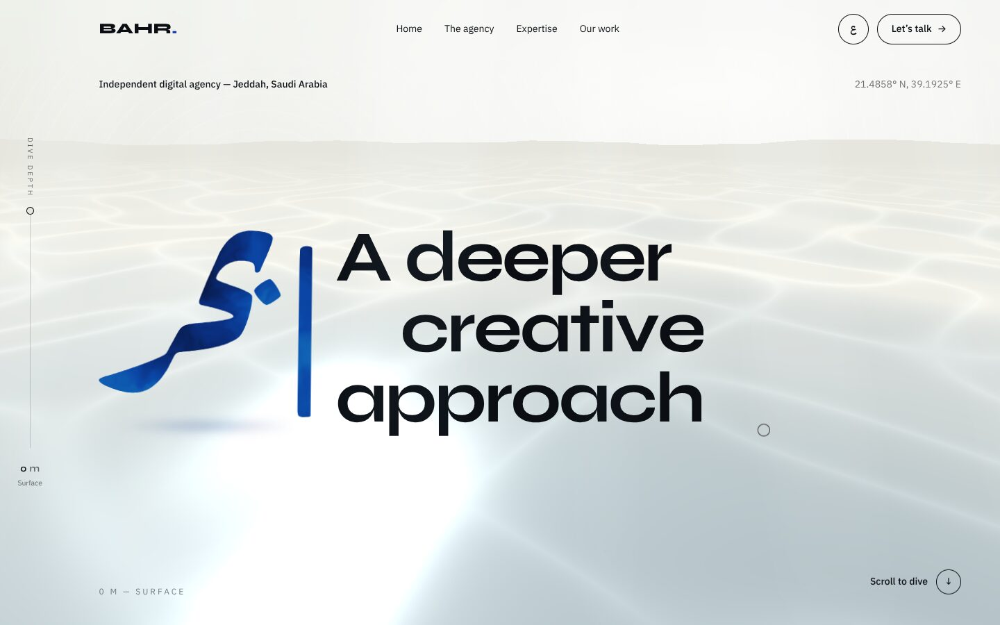

| | |
|---|---|
| 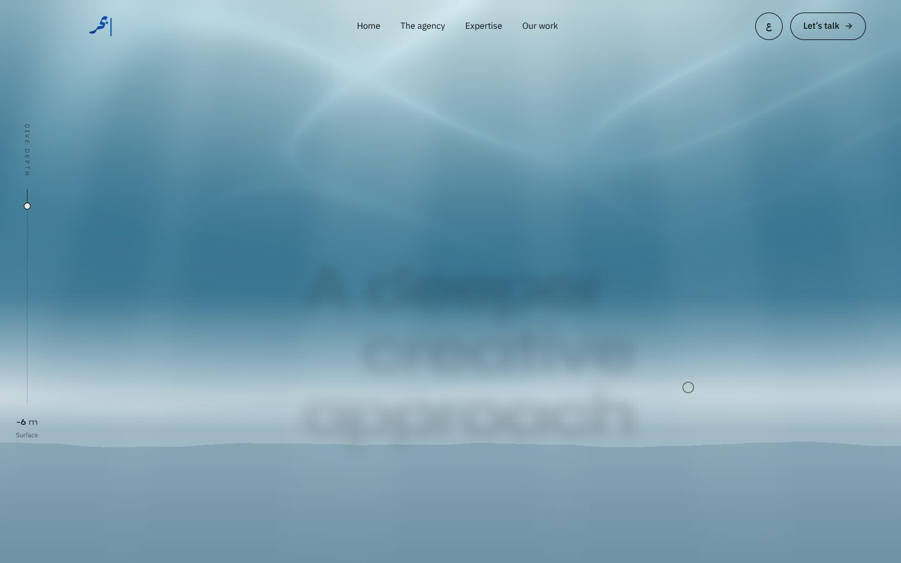 | 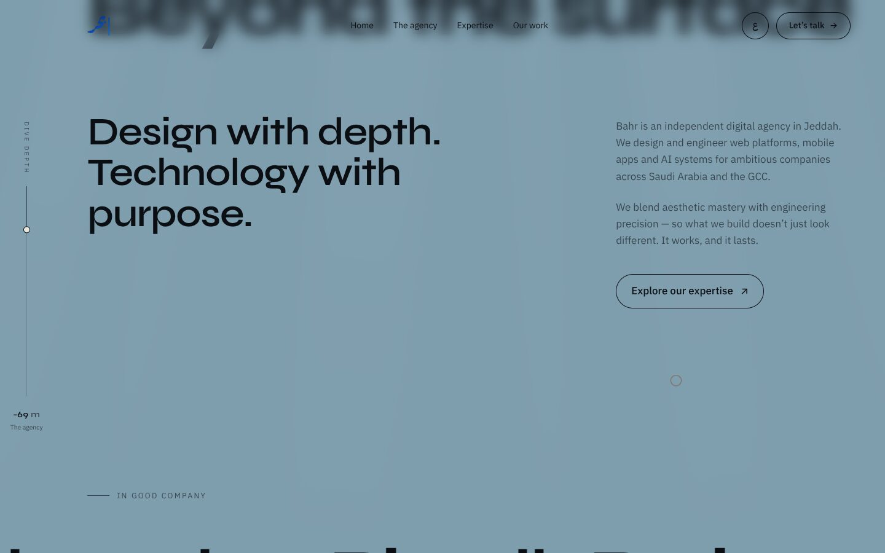 |
| 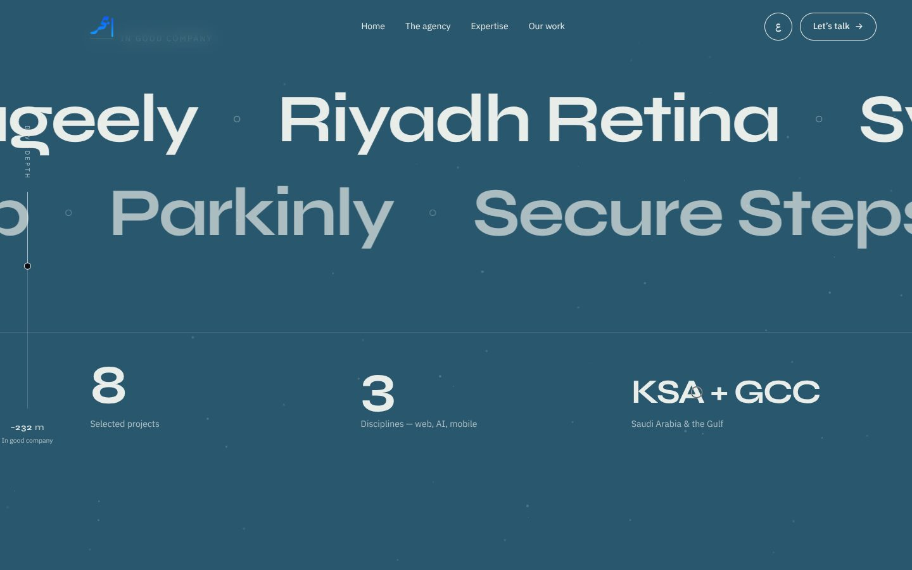 | 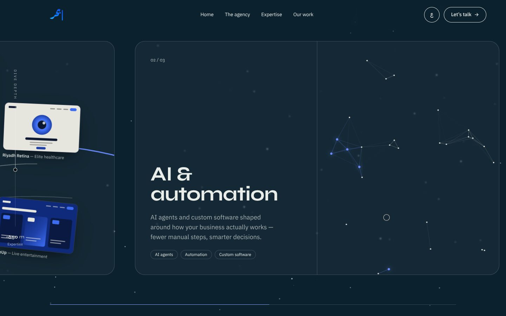 |
| 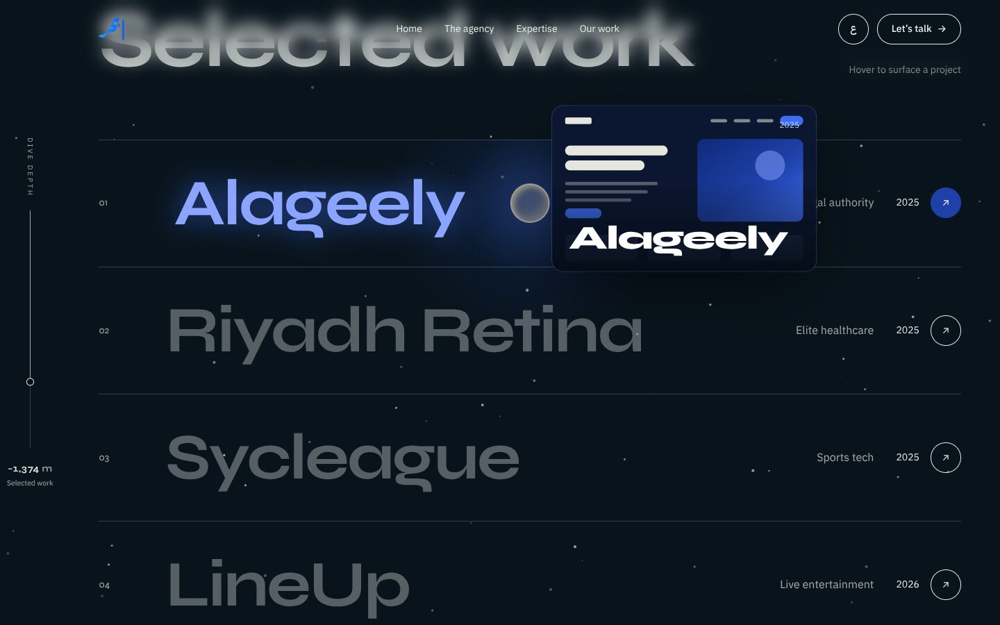 | 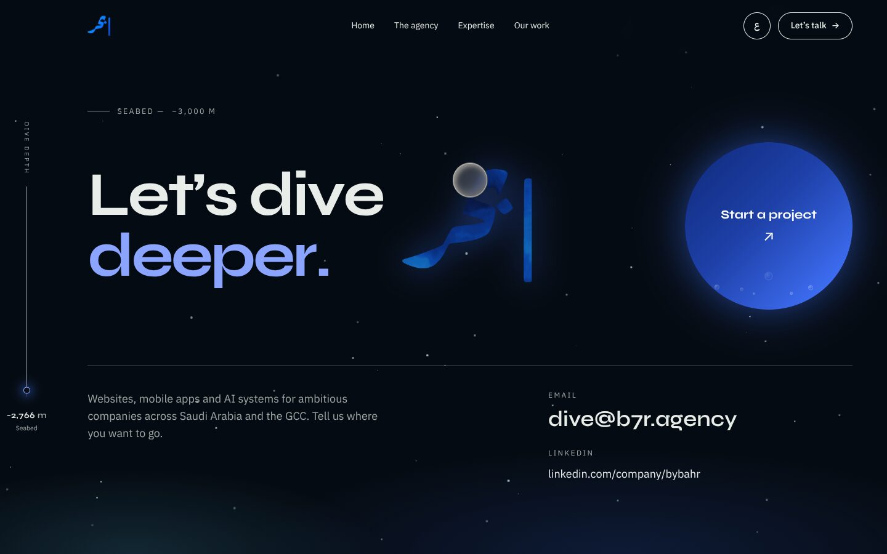 |
| 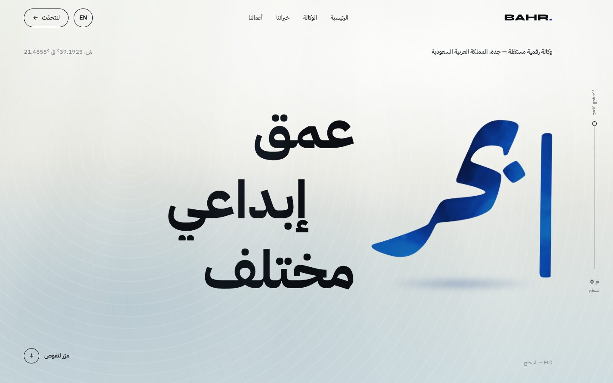 | 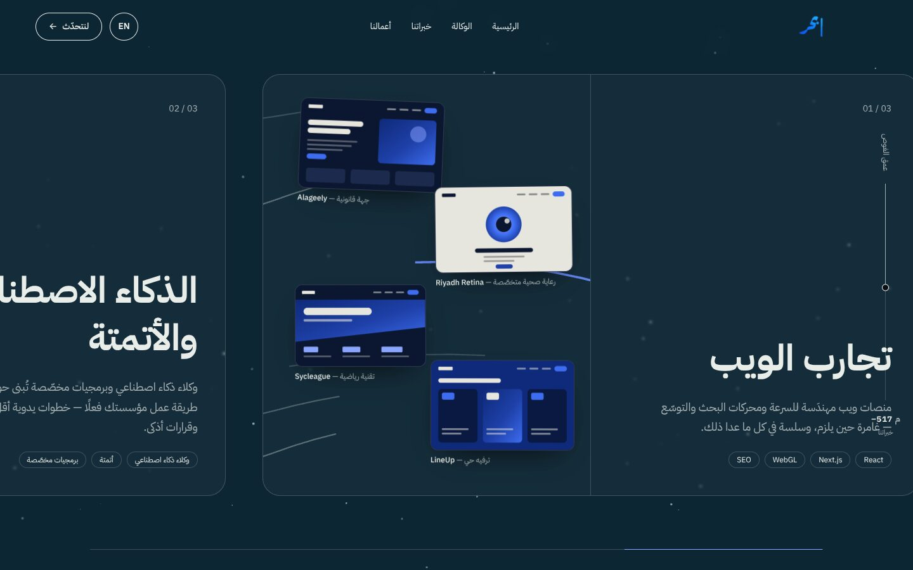 |

**On phones** (designed separately, not a shrunk desktop):

| | | |
|---|---|---|
| 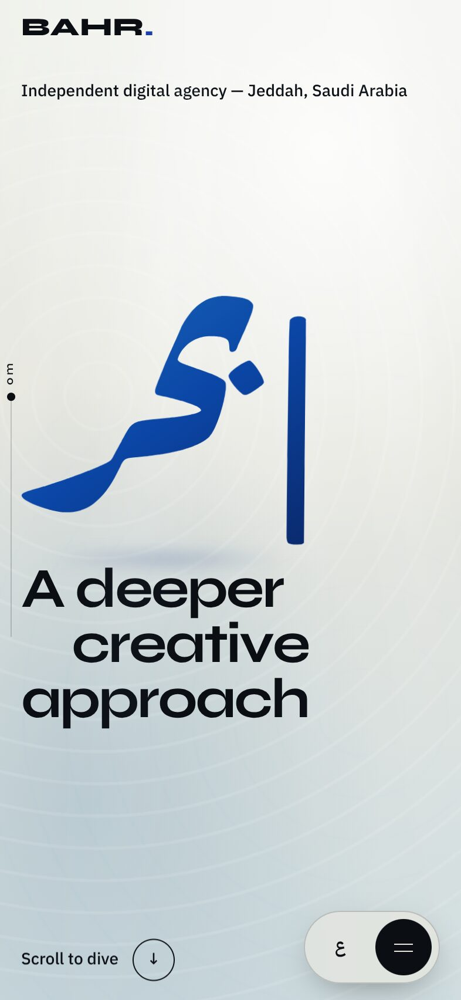 | 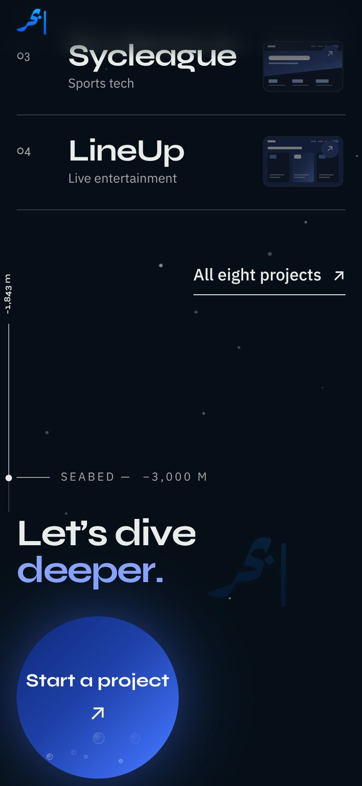 | 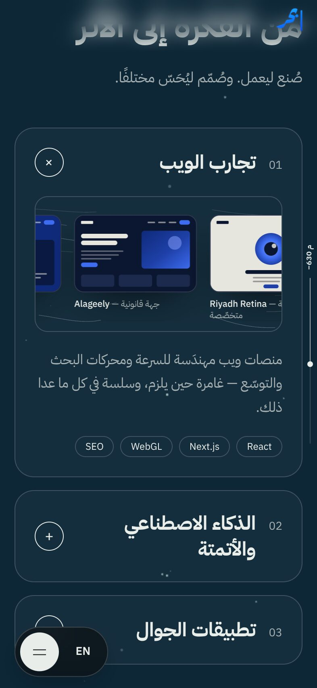 |

## What's in it

- **Global dive system.** A single page-wide ScrollTrigger maps scroll position to the background colour along
  `#e6e6df → #9fb7c4 → #2c5d73 → #0e2a3a → #050b12`, a `--depth` variable and the depth in metres. Text switches from ink
  to light based on the background's luminance, so contrast stays readable at every depth.
- **Depth meter.** It sits on the inline-start side (left in English, right in Arabic) and shows an eased counter from
  `0 m` to `−3,000 m` plus the current section label. On phones it becomes a slim gauge inside the side margin, so
  it never covers content.
- **Light and particles.** Light rays fade as you sink. Below −200 m, sparse "marine snow" drifts upward.
- **Hero.** A WebGL water surface (React Three Fiber, a custom shader, cursor ripples) is lazy-loaded behind a CSS
  fallback, and the headline paints first.
  - The headline is revealed with SplitText.
  - A pinned, scrubbed scene handles **breaking the surface**: the camera dips below the waterline, the surface tilts
    and rises away, a meniscus sweeps past the lens, and the headline sinks and blurs.
  - **Bahr's «بحر» mark** floats at the surface, locked up with the headline as one unit: beside it on desktop,
    above it on phones.
    - It's a vector with a living liquid gradient inside the letters, in Bahr's blues. It drifts on its own and stirs
      with a soft ripple when the pointer or a finger moves inside the letters.
    - As you start scrolling it shrinks and flies up into the nav, scrubbed with the scroll. The "BAHR." wordmark
      cross-fades out as the mark lands in its place, and the mark is the logo for the rest of the page. Scrolling back
      to the top reverses both.
- **The agency.** The statement is revealed word by word on scroll, the paragraphs rise line by line, and the
  "Explore our expertise" button has a magnetic hover.
- **In good company.** Project names drift in two rows in opposite directions like currents. The speed reacts to scroll
  velocity, and hovering pauses a row and lights a name in the accent colour. Below them are three count-up stats
  built only from real facts.
- **Expertise.** On desktop, a pinned horizontal scroll moves through three panels, each with a hand-made animated
  visual: flowing current lines (web), glowing plankton nodes (AI), and a phone with sonar rings (mobile). In the web
  panel, Bahr's projects (Alageely, Riyadh Retina, Sycleague, LineUp) drift along the currents like debris carried by
  the stream. Each one is a designed abstract mini-site in Bahr's colours (nav bar, hero block, content lines, a
  different layout per project), labelled with its name and sector. These are not fake screenshots. On mobile the
  panels become accordion cards with Framer Motion layout animation, and the frames become a small drifting strip.
- **Selected work.**
  - Hovering a project row shows a royal-blue glow that follows the cursor, plus a floating preview card.
  - Clicking plays a circle-wipe "portal" and then opens the project on bybahr.com in a new tab.
- **Seabed.**
  - The giant line "Let's dive deeper." sits here, and the depth meter pulses once at −3,000 m.
  - Bahr's «بحر» mark, in its liquid gradient, glows in beside it as one lockup, like the treasure at the bottom of
    the dive.
  - The email button is a large circle with rising bubbles and a slight magnetic pull.
  - "Back to surface ↑" scrolls to the top with Lenis while the meter counts back up and the colours reverse.
- **Arabic and RTL.**
  - A toggle sets `dir="rtl"` and `lang="ar"`, swaps to IBM Plex Sans Arabic, saves the choice, and refreshes
    ScrollTrigger.
  - The layout uses logical CSS properties, so the depth meter, marquee, horizontal scroll and slide directions all
    mirror.
  - Arabic text is split into words, never into characters.
  - Switching language fades a short veil in, rebuilds the page in the new direction and returns you to the same spot.
    An error boundary means a failure never leaves a blank page.
- **Accessibility.**
  - Landmarks, a skip link, visible focus styles, ARIA labels, full keyboard support, and screen-reader text for
    split headlines.
  - A complete `prefers-reduced-motion` version with no WebGL, no pins and no Lenis, just simple fades.
- **Delights.**
  - A custom cursor: a small ring that becomes a bubble over links.
  - A skippable intro of about 1.3 s: a drop hits the water and the ripple resolves into Bahr's mark. It plays over a
    page that has already rendered.

## Stack

Vite · React 19 · TypeScript · Tailwind CSS v4 · Framer Motion (`motion`) · GSAP + ScrollTrigger + SplitText ·
Lenis · React Three Fiber + drei · three.js · Vercel

**Animation rule:** GSAP owns everything linked to scroll, and Framer Motion owns hover, menu, toggle and mount
animations. The two libraries never animate the same property of the same element.

## Mobile

Phones get their own design, not a shrunk desktop. "Phone" means a narrow screen, or a short touch screen, so landscape
phones count too.

- **Scrolling.** Scrolling is native: no Lenis and no smoothing on touch. The hero dive is a short pin of about 65svh,
  Expertise becomes cards, and nothing traps the finger.
- **Layout.** Heights use `svh`, safe-area insets are respected (notch and home bar), side gutters are 18–20 px, and
  the type scale is fluid.
  - The hero size accounts for viewport height, so landscape fits.
  - Arabic body text is a little larger, with taller line-height.
- **Thumb zone.** The wordmark stays on top. Language and menu sit in a floating dock at the bottom, and the menu opens
  as a bottom sheet that closes from the same button. The dock steps aside while you scroll down and comes back when
  you scroll up. Every tap target is at least 44 px.
- **No hover on touch.**
  - The custom cursor is off.
  - A work row lights up and shows its preview when it reaches the middle of the screen.
  - The client name drifting through the centre lights up, and tapping a row holds it still.
- **Any system theme.** The page opts out of browser auto-dark (`color-scheme: only light`), so phones in dark mode
  still get the bright surface and the dark seabed.
- **Lighter rendering.** DPR is capped at 1.25 and the WebGL grid is lighter. Low-end devices or data-saver keep the CSS
  water, marine snow drops to 18 particles, the intro is shorter and skippable with a tap, and off-screen visuals render
  lazily.

## Performance

- `index.html` contains a static, styled copy of the hero, so it appears on the first paint. React, GSAP and Motion
  start after that first paint, so they never compete with it.
- Motion features are lazy-loaded with `LazyMotion`.
- The WebGL chunk loads on the first interaction, or when the browser is idle a few seconds after load.
  - Its DPR is capped at 1.5, and drei's `PerformanceMonitor` lowers it on slow devices.
  - It pauses when the hero is off-screen or the tab is hidden.
- Fonts are self-hosted, subset and preloaded.

Lighthouse (local production build, Lighthouse 12 with its default simulated throttling):

| | Performance | Accessibility | Best practices | SEO |
|---|---|---|---|---|
| Mobile | **87–90** | 100 | 100 | 100 |
| Desktop | **88–96** | 100 | 100 | 100 |

## Run it

```bash
npm install
npm run dev       # http://localhost:5173
npm run build     # typecheck + production build → dist/
npm run preview   # serve the build
```

Deploy: import the repo in Vercel. The defaults work as they are (framework **Vite**, build `npm run build`, output
`dist`), so no `vercel.json` is needed.

## Content

All copy lives in `src/content/en.ts` and `src/content/ar.ts`, taken from Bahr's own site:

- the eight projects (Alageely, Riyadh Retina, Sycleague, QVS, Parkinly, Secure Steps, MASS, LineUp)
- the email `dive@b7r.agency`
- the LinkedIn page
- the positioning and brand lines

The official Arabic hero line «عمق إبداعي مختلف» is used as is. `CLAUDE.md` → *Decisions* notes which Arabic strings are
still our own translation.

## Adding Bahr's images

Project screenshots are optional. Only files that exist are referenced, so nothing 404s, and the dev server needs a
restart after you add files.

- **Project screenshots.** Drop `alageely`, `riyadh-retina`, `sycleague` and `lineup` (`.png`, `.jpg` or `.webp`) into
  `public/work/`, then run `npm run images`. That converts them to WebP (max 1280 px wide) and removes the originals.
  A project without a file shows its designed abstract mini-site instead.

## The «بحر» mark

`src/assets/bahr-mark.svg` is a clean vector of Bahr's mark.
- **How it was made.** The blue pixels were masked from two screenshots of bybahr.com, leaving out the light
  background, the grey contour lines, the black words and the gold dot. The vertical stroke was rebuilt where text
  crossed it. The mask was then smoothed, traced with potrace and checked against both screenshots at high zoom. It
  matches the mark's pixels at IoU 0.998 on the large screenshot and 0.91 on the small one, where anti-aliasing
  dominates.
- **How it's drawn.** `<BahrMark />` clips a small raw-WebGL canvas, about 2 KB of shader and no three.js, with that
  path. The canvas paints a flowing, domain-warped noise gradient in Bahr's blues; the pointer or a finger inside the
  letters stirs it with inertia.
- **Fallbacks.** Reduced motion, low-end phones and browsers without WebGL get the SVG with a slowly turning gradient.
  It pauses off-screen, caps DPR at 1.5 (1.25 on touch) and is labelled "Bahr".
- **Where it appears.** It's used in the hero (then the nav), the intro ripple and the seabed.

## Credits

- Concept, design and code: built with **Claude Code** for the GDG on Campus UJ × Bahr challenge.
- Inspired by techniques seen on Awwwards: *Convex Seascape Survey* (Unseen Studio), *Unseen Studio*, and *Ghost Network*
  (Noise Studio). No assets or code were copied.
- Fonts: [Syne](https://fonts.google.com/specimen/Syne) and [IBM Plex Sans Arabic](https://fonts.google.com/specimen/IBM+Plex+Sans+Arabic),
  both under the SIL Open Font License.
- The «بحر» mark belongs to Bahr.
- All brand content belongs to Bahr Agency, including the «بحر» calligraphy mark, the "BAHR." wordmark and the
  project screenshots. They are used here only for this challenge entry.
